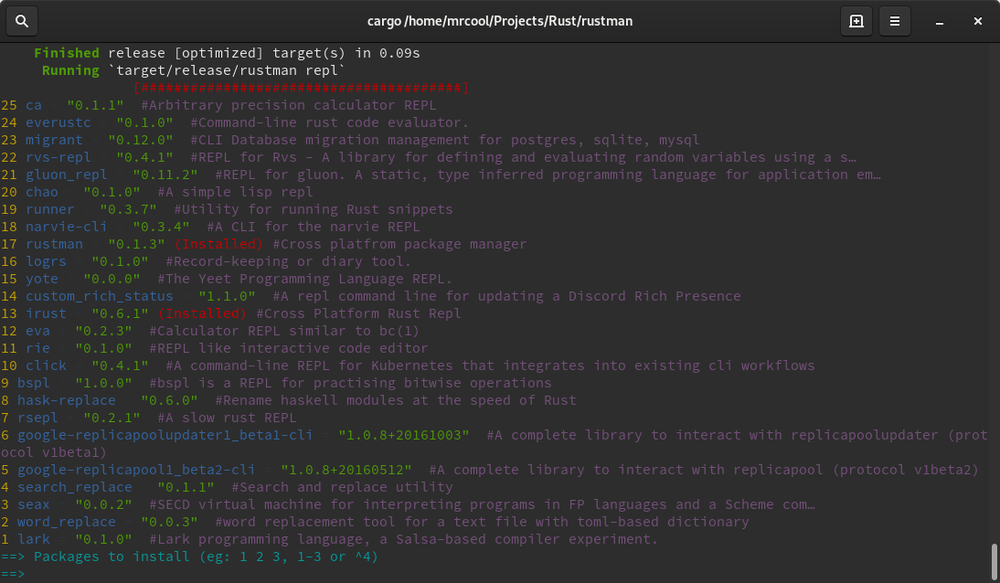

# rustman
Cross platfrom package manager

## Description
Search and install rust binaires

## Usage
*Update all local packages*

`rustman`

*Search and install interactively a specific pacakge*

`rustman $package`

*install a pacakge*

`rustman -S $package`

*remove a pacakge*

`rustman -R $package`

*show installed pacakges*

`rustman --installed`

## Advanced usage
*install a binary from a custom url*
`rustman -S binary --custom-url $binary_url --version $custom_version`

This is useful for downloading binaries while keeping the `.crates.toml` updated

Note this manually modifies `$HOME/.cargo/.crate.toml`! rustman will create copies of the original `.crates.toml` in $Temp/rustman in case something went wrong

## Example
`rustman repl`

## [Changelog](./CHANGELOG.md)
